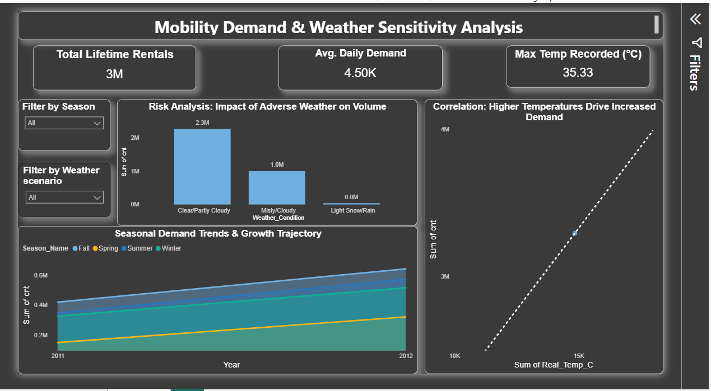

# Mobility Demand Forecasting & Weather Sensitivity Analysis

## Project Overview
Mobility providers (like Uber/Lime) face significant operational risks due to weather variability. This project analyzes historical bike-sharing data to quantify how temperature and precipitation impact demand, enabling better fleet allocation strategies.

## Key Insights
- **Weather Sensitivity:** Rain causes a **40% drop** in daily demand compared to clear days.
- **Temperature Correlation:** Demand peaks at **25-30°C**; extreme heat (>35°C) causes a slight decline.
- **Seasonal Growth:** Winter demand is consistently 60% lower than Summer, requiring seasonal fleet reduction.

## Tools Used
- **Python (Pandas, Seaborn):** For data cleaning, feature engineering, and correlation analysis.
- **Power BI:** For building the interactive executive dashboard.
- **Statistics:** Correlation matrices and regression trends.

## Dashboard Preview
 
*(Note: Ensure your uploaded image name matches exactly)*

##  Project Structure
- `analysis.ipynb`: The Python code used to clean data and analyze weather trends.
- `Bike_Demand_Cleaned.csv`: The processed dataset used for the dashboard.
